# User Manual

This guide is for people using Sekiei for the first time.

The public build is available at https://sekiei.pages.dev/.

The built version is meant to be usable with only the in-app `Manual`. Screenshots help you understand the screen layout. When the UI changes, replace screenshots as needed.

## 1. Getting Started

### What Sekiei Can Do

With Sekiei, you can:

- Create 3D models from crystal parameters
- Build single-crystal and twin-crystal configurations
- Adjust each face's distance, color, visibility, and engraved text
- Preview the model in 3D in the browser
- Save STL / SVG / PNG / JPEG / JSON files

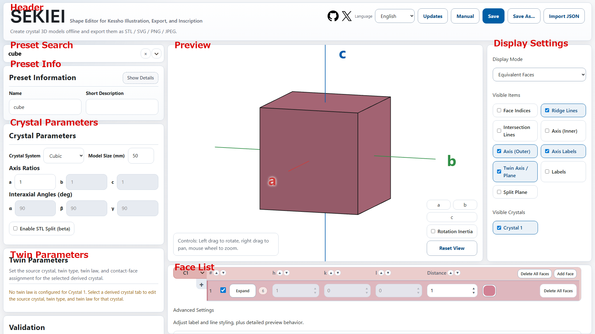

### Reading the Screen

On desktop, you mainly use these areas.

- Left side
  - Preset Search, Crystal Parameters, Twin Parameters, and Face List
- Center
  - 3D Preview
- Right side
  - Display Mode, visibility toggles, Visible Crystals, and Preview Detail Settings
- Header
  - Save, import, notice, manual, and language controls

On a phone, the edit tabs appear below the preview: `Basic / Face / Twin / Display / Output`.

- `Basic`
  - Presets, crystal parameters, and STL split
- `Face`
  - Face List and engraved text settings
- `Twin`
  - Twin parameters
- `Display`
  - Display mode, visibility toggles, Visible Crystals, and Preview Detail Settings
- `Output`
  - JSON save/load and STL / SVG / PNG / JPEG export

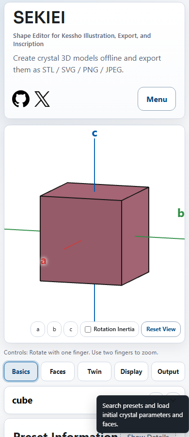

### Using the In-App Manual

You can open this manual from inside the tool.

- On desktop, open it from the `Manual` button in the header
- On phones, open `Menu` in the top-right header and choose `Manual`
- On desktop, use the table of contents on the left to jump to a section
- On phones, use `Open Contents` at the top of the manual
- The manual opens on top of the screen, and your current inputs stay as they are

### Reading Notices

On startup, a `Notice` may show recent updates and known issues.

- Once you close a notice, it will not appear automatically again unless its updated date changes
- You can reopen it from the `Updates` button in the header
- The GitHub and X icons in the header open the repository and the author's X profile
- On phones, `Updates` and the language selector are also available from the top-right `Menu`

## 2. Quick Start

### Shortest Workflow

For your first model, use this order.

1. Choose a preset
2. Adjust crystal parameters if needed
3. Edit faces or crystals in the Face List if needed
4. To make a twin, add a crystal in the Face List, then adjust Twin Parameters
5. Check the shape and display in the preview
6. Choose an output format and save

### Where to Go First

- Choose a starting shape
  - `Preset Search`
- Change axis ratios or interaxial angles
  - `Crystal Parameters`
- Change face count, color, or face direction
  - `Face List`
- Build a twin
  - Add a crystal in `Face List`, then use `Twin Parameters`
- Change how the preview looks
  - `Display Mode` and visibility toggles
- Save a file
  - `Save`, `Save As...`, or the phone `Output` tab

### Main Buttons and Menus

This manual explains plain text buttons in writing instead of relying on button-only screenshots.

- `Save`
  - Saves the current content with the selected default format
- `Save As...`
  - Lets you choose a format and file name when saving
- `Import JSON`
  - Imports Sekiei JSON. You can choose `All`, `Crystal Data`, or `Preview Settings`
- `Updates`
  - Opens update history and known issues
- `Manual`
  - Opens this manual inside the tool
- `+`
  - Adds a crystal in the Face List
- `Add Face`
  - Adds one face to the currently selected crystal
- `Delete All Faces`
  - Clears the face list for the currently selected crystal
- `Create Equivalent Faces`
  - Adds related faces with equivalent directions
- `Reset View`
  - Returns the preview direction and zoom to an easy-to-read state

### Choosing a Save Format

- STL
  - Use this when you need a 3D model
- SVG
  - Use this when you need a vector image with lines and labels
- PNG / JPEG
  - Use these when you want the preview image as it appears on screen
- JSON
  - Use this when you want to continue editing later in Sekiei

## 3. Basic Tutorials

### Create a Single Crystal and Save STL

1. Choose the starting crystal in `Preset Search`
2. Adjust `Model Size`, `Axis Ratios`, or `Interaxial Angles` in `Crystal Parameters` if needed
3. Hide or delete unnecessary faces in `Face List`
4. Check the shape in the preview
5. Choose `STL` from `Save`

Presets are starting values. You can freely edit them after selection.

### Start From a Preset

Use the preset search field near the top of the screen to choose common shapes.

- Selecting a preset fills in the crystal system, axis ratios, interaxial angles, face list, and related values
- A single-crystal preset resets the model to one crystal, while a twin preset loads its twin structure
- Display mode and visibility toggles keep their current settings after selecting a preset
- You can edit every value after selecting a preset

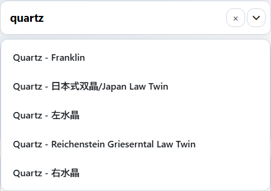

### Create a Twin

1. Create the base crystal
2. Press `+` in the Face List crystal tabs to add a crystal
3. Adjust the added crystal in `Twin Parameters`
4. Choose the `Twin Type`
5. For a contact twin, set the twin plane and contact face references
6. For a penetration twin, set the twin axis, rotation angle, and axis offset if needed
7. Check the relationship in the preview
8. Save STL / SVG / PNG / JPEG as needed

The Twin Parameters card adjusts twin settings. To create a twin, first add another crystal from the Face List crystal tabs.

### Add Text to a Face

1. Find the target face in `Face List`
2. Open that face's `Text` settings
3. Set the engraved text, font, text size, and depth
4. Adjust horizontal position, vertical position, and rotation
5. Check the position and size in the preview
6. Use the outline shown on the face to check the actual text boundary and placement

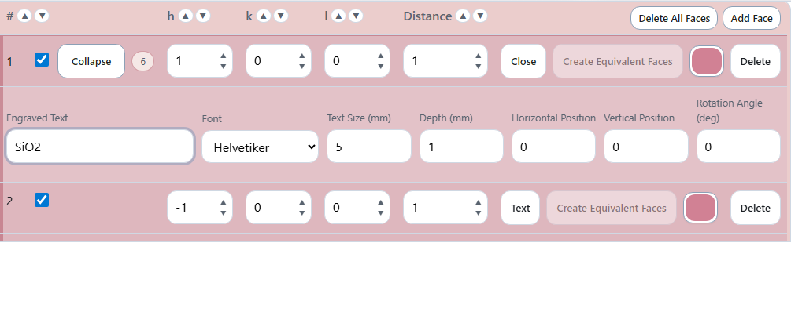

### Save as an Image

1. Adjust preview direction, display mode, and visibility toggles
2. Use `Reset View` or the axis view buttons if you need a fixed direction
3. Choose `SVG`, `PNG`, or `JPEG` from `Save`

SVG is useful when you want editable lines and labels. PNG and JPEG are useful when you want the preview appearance as an image.

## 4. Task Guides

### Adjust Crystal Parameters

`Crystal Parameters` controls the crystal system, model size, axis ratios, and interaxial angles.

- `Crystal System`
  - Changes available inputs and the face-index format
- `Model Size`
  - Sets the approximate maximum size of the generated model
- `Axis Ratios`
  - Sets the ratio of the `a / b / c` axes
- `Interaxial Angles`
  - Sets `alpha / beta / gamma`

Some values are fixed or linked depending on the crystal system.

### Edit the Face List

The Face List is the main place where you define the crystal shape. One row is one face. For each face, you decide its direction, how far it moves toward the center, whether it is visible, and what color it uses.

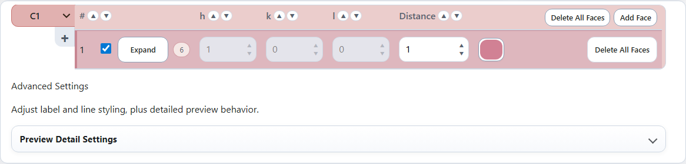

Even without knowing Miller indices, you can start with these ideas.

- `h / k / l`
  - Numbers that control the face direction
- `i`
  - An extra number shown for trigonal and hexagonal systems
- `Distance`
  - Controls how far the face is placed from the center
- `Color`
  - The display color of that face
- Visibility toggle
  - Turns that face on or off for model generation
- Text settings
  - Adds engraved or label text to that face

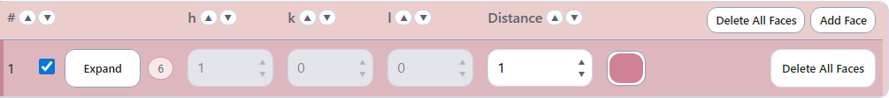

On desktop, the Face List is a table. On phones, each face is edited as a card.

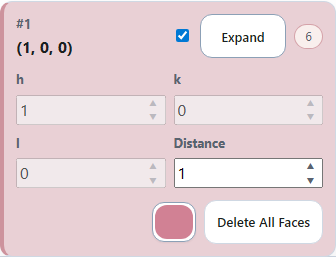

Press `Add Face` to add a new row to the currently selected crystal. In the new row, enter `h / k / l`, distance, and color to add another boundary face to the shape.

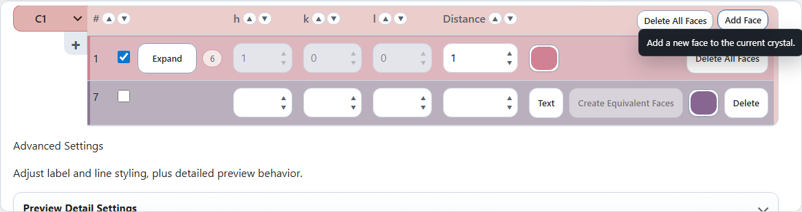

### Understanding h / k / l Face Indices

`h / k / l` are numbers that describe the direction of a face. You do not need to memorize strict crystallographic terminology to begin using Sekiei.

- Change `h`
  - Changes the face direction relative to the a axis
  - A larger absolute value makes the face pass closer to the center along the a-axis direction; a smaller absolute value moves it farther from the center
  - When `h` is `0`, the face does not intersect the a axis
  - Positive values intersect the positive side of the a axis; negative values intersect the negative side
- Change `k`
  - Changes the face direction relative to the b axis
  - A larger absolute value makes the face pass closer to the center along the b-axis direction; a smaller absolute value moves it farther from the center
  - When `k` is `0`, the face does not intersect the b axis
  - Positive values intersect the positive side of the b axis; negative values intersect the negative side
- Change `l`
  - Changes the face direction relative to the c axis
  - A larger absolute value makes the face pass closer to the center along the c-axis direction; a smaller absolute value moves it farther from the center
  - When `l` is `0`, the face does not intersect the c axis
  - Positive values intersect the positive side of the c axis; negative values intersect the negative side
- Reverse the sign
  - Creates a face facing the opposite side
- Set all values to `0`
  - This cannot be used because the face direction is undefined

For example, `(1, 0, 0)` and `(-1, 0, 0)` are opposite faces related to the same axis. If you enter values on multiple axes, such as `(1, 1, 0)`, the face becomes diagonal across those axes.

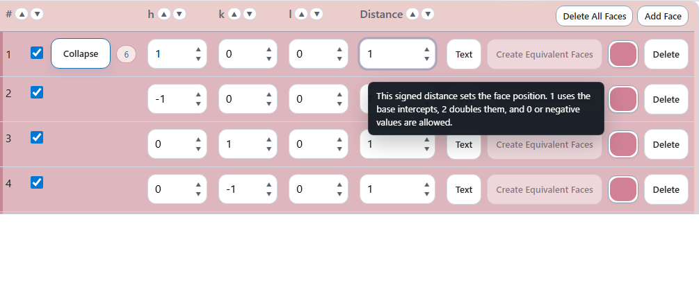

### Crystal Systems That Show i

Trigonal and hexagonal systems use four face indices: `h / k / i / l`.

- `i` also helps describe the face direction, like `h / k / l`
- In Sekiei, `i` is read-only and is automatically calculated from `h` and `k`
- The automatic calculation keeps `h + k + i = 0`
- For example, if `h = 1` and `k = 0`, then `i = -1`

In normal operation, you do not need to adjust `i` yourself. When you increase or decrease `h` or `k`, `i` changes automatically.

### Understanding Distance

`Distance` controls how far the face is from the center of the crystal. When the shape is created, each face works as a boundary that cuts the crystal from outside.

- Increase the distance
  - The face moves outward and the model becomes longer in that direction. In most cases, the face itself becomes smaller
- Decrease the distance
  - The face moves toward the center and the model becomes shorter in that direction. In most cases, the face itself becomes larger
- Set the distance to `0`
  - The face passes through the center. It can be used only when the other faces still form a closed solid
- Use a negative distance
  - The face moves to the opposite side. Depending on the opposite face, it can still form a closed solid
- Multiply every face distance by the same amount
  - The final model is scaled to `Model Size`, so the visible proportions usually stay almost the same

For a crystal with axis ratio `a / b / c`, a `(1, 1, 1)` face at distance `1` passes through distance `a` on the a axis, distance `b` on the b axis, and distance `c` on the c axis. At distance `2`, it passes through `2a / 2b / 2c`.

When you want to adjust a shape, change one face slightly and watch the preview.

### Face Visibility

The visibility toggle for each face controls whether that face is used in the current shape.

- On
  - The face is used to build the solid
- Off
  - The face is temporarily removed from the solid

Before deleting a face, turn it off first to see how the shape changes. This makes it easier to go back.

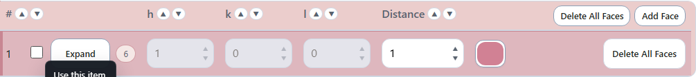

### Create Equivalent Faces

`Create Equivalent Faces` adds related faces with directions equivalent to the selected face. Use it when you want to fill in matching faces for a symmetric crystal.

For example, after making one side face, you can add the corresponding side faces together. You can still hide or delete unnecessary faces afterward.

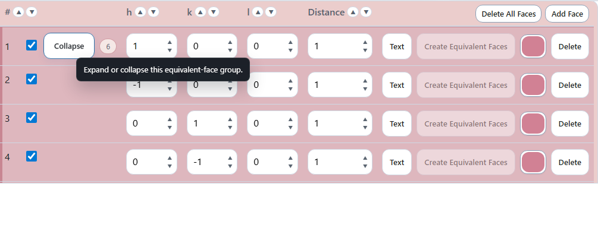

### Face Color and Text

In the Face List, you can also set each face's color and text.

- Color
  - Changes the color used in the preview and image export
- Text
  - Adds engraved text or label text to the face

When a face has text, an outline appears on the preview face. Use the outline to check whether the text fits inside the face.

### Add Crystals

Use the Face List crystal tabs when you want to create a twin or overlap multiple crystals.

- Switch the edited crystal with the tabs on the left
- Press `+` to add a crystal
- Use the menu on the right side of each tab to duplicate, recolor, or delete a crystal

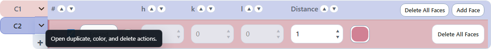

After adding a crystal, use `Twin Parameters` to adjust how it is placed.

### Adjust Twin Parameters

Twin Parameters controls how an added crystal is placed.

- Source crystal
- Twin type
- Twin plane or twin axis
- Rotation angle
- Axis offset
- Contact face reference
- Reference direction

For a contact twin, the contact faces are aligned. For a penetration twin, the added crystal is rotated around the twin axis and placed over the source crystal.

For penetration twins, `Axis Offset` moves the added crystal along the twin axis. `0` means no axis-direction offset. Positive values move in the positive twin-axis direction, and negative values move in the opposite direction.

`1` uses the distance from the center to the point where the twin axis meets the distance `1` face with the same indices as the twin axis. The distance changes linearly, so `0.5` is half that distance and `2` is twice that distance.

### Adjust the Preview

In the preview, you can check both the shape and how it is displayed.

- Change the display mode
- Show or hide face indices, ridge lines, intersection lines, axes, labels, and guides
- Toggle visibility for each crystal
- Use `Preview Detail Settings` to adjust line colors, label colors, and related settings if needed

For faces with engraved text, the text boundary on the face is shown as an auxiliary line. This is separate from the `Intersection Lines` toggle and helps you check text position and size.

### Use Sekiei on a Phone

On phones, use the tabs below the preview to switch editing categories.

- `Basic`
  - Adjust the starting point and crystal parameters
- `Face`
  - Edit faces and engraved text
- `Twin`
  - Adjust twin parameters
- `Display`
  - Adjust how the preview looks
- `Output`
  - Save files and import JSON

Preview controls on a phone are:

- One finger to rotate
- Two fingers to zoom
- `Reset View` to restore an easy-to-read view

### Save and Resume with JSON

Save JSON when you want to continue editing later in Sekiei.

- `Save JSON`
  - Saves crystal data and preview settings
- `Import JSON (All)`
  - Imports crystal data and preview settings
- `Import JSON (Crystal Data)`
  - Imports only shape and Face List data
- `Import JSON (Preview Settings)`
  - Imports only display settings

## 5. Feature Reference

### STL Split (beta)

At the bottom of the Crystal Parameters card, `Enable STL Split (beta)` is used only for STL export.

- Turn on `Enable STL Split (beta)` to split the model during normal STL export
- The split-plane index inputs are shown only while this setting is on
- The split plane is the plane with the specified face indices passing through the center of Crystal 1
- You can save STL split by the specified plane
- STL split settings are not included in JSON save data

### Display Mode

Select the display mode at the top of the right-side card.

- Equivalent Faces
  - Shows equivalent faces with related colors
- Single Color
  - Shows each crystal in one color so the shape is easy to check
- Gray
  - Reduces color influence so the shape is easier to inspect
- Colorless Transparent
  - Shows internal and back-side relationships
- Custom (beta)
  - Uses the appearance defined in detailed settings

### Visibility Toggles

The right-side card lets you toggle:

- Face Indices
- Ridge Lines
- Intersection Lines
- Axis (Inner)
- Axis (Outer)
- Axis Labels
- Twin Axis / Plane guide
- Split Plane
- Labels
- Visibility for each crystal

### Preview Detail Settings

`Preview Detail Settings` controls detailed display settings.

- Line color
- Line width
- Opacity
- Label color
- Font
- Custom display settings

### Save and Import

The header save menu can save:

- STL
- SVG
- PNG
- JPEG
- JSON

On phones, the main save and import actions are collected in the `Output` tab.

- `Project Data`
  - `Save JSON`
  - `Import JSON (All / Crystal Data / Preview Settings)`
- `3D Model`
  - `STL`
- `Preview Image`
  - `SVG / PNG / JPEG`

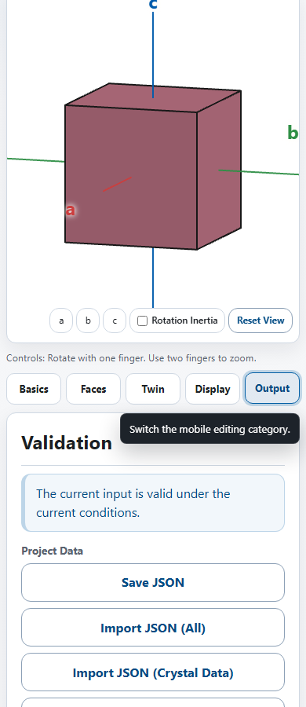

## 6. Troubleshooting

### I Cannot Find a Preset

- Search by part of the Japanese name, English name, or mineral name
- If the exact preset is missing, choose a similar shape and adjust it manually
- Return to `Custom Input` to keep the current manual values and continue editing

### The Preview Is Hard to Read

- Press `Reset View`
- Change display mode to `Single Color` or `Gray`
- If there are too many face indices or axis labels, hide some items with visibility toggles
- Transparent modes also show back-side lines and faces, so switch back to a normal mode if needed

### The Twin Is Not Where I Expected

- Check that another crystal has been added in the Face List
- Check that `Source Crystal` points to the intended crystal
- For a contact twin, check the contact face references for both the source and added crystals
- For a penetration twin, check the twin axis, rotation angle, and axis offset
- Turning on the `Twin Axis / Plane` guide can make the relationship easier to see

### Text on a Face Is Not Visible

- Check that the target face's `Text` settings are open
- Check that text size and depth are not too small
- Check that the face visibility toggle is on
- Use the text outline in the preview to check whether the text fits inside the face

### I Am Unsure Which Export Format to Use

- Choose STL for 3D model data
- Choose SVG if you want to edit the figure as vector artwork
- Choose PNG or JPEG if you want to share the current appearance
- Save JSON if you want to edit the project again in Sekiei

### I Am Unsure Which JSON Import Mode to Use

- Choose `All` to restore a previous working state as-is
- Choose `Crystal Data` to replace the shape while keeping the current display settings
- Choose `Preview Settings` to restore only the appearance while keeping the current shape

### I Cannot Find an Item on a Phone

- Shape basics are in the `Basic` tab
- Face editing is in the `Face` tab
- Twin settings are in the `Twin` tab
- Display settings are in the `Display` tab
- Save and import actions are in the `Output` tab

## 7. Notes

- Complex twin configurations may show warnings
- Presets are starting values and can be edited manually afterward
- The Japanese UI is the primary source, but you can switch to the English UI
- Manual text and screenshots are updated when the UI changes
