# User Manual

この文書は、Sekiei を初めて使う人向けの操作ガイドです。

公開版は https://sekiei.pages.dev/ から利用できます。

ビルド済みの公開版を使う場合も、ツール内の `マニュアル` だけで基本操作を確認できるようにしています。スクリーンショットは画面構成を把握するためのものです。UI が更新されて見た目や配置が変わった場合は、必要に応じて画像を差し替えます。

## 1. はじめに

### Sekiei でできること

Sekiei では、次のような作業ができます。

- 結晶パラメーターから 3D モデルを作る
- 単結晶や双晶構成を作る
- 面ごとの距離、色、表示、文字加工を調整する
- ブラウザ上で 3D プレビューする
- STL / SVG / PNG / JPEG / JSON を保存する

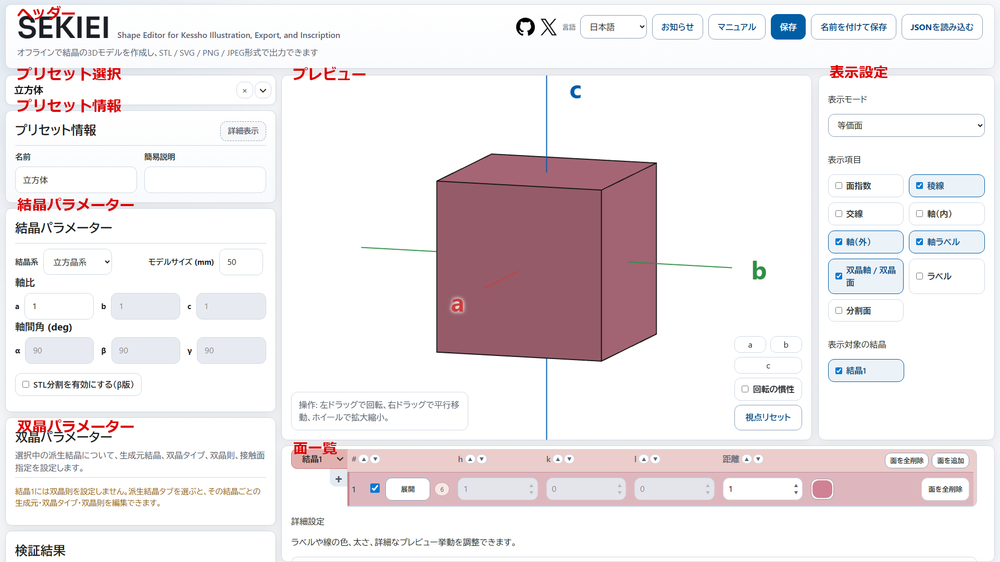

### 画面の見方

デスクトップでは、主に次の領域を使います。

- 左側
  - プリセット、結晶パラメーター、双晶パラメーター、面一覧
- 中央
  - 3D プレビュー
- 右側
  - 表示モード、表示トグル、表示対象の結晶、プレビュー詳細設定
- 上部
  - 保存、読み込み、お知らせ、マニュアル、言語切り替え

スマホでは、プレビューの下に `基本 / 面 / 双晶 / 表示 / 出力` タブが並びます。

- `基本`
  - プリセット、結晶パラメーター、STL分割
- `面`
  - 面一覧と面文字設定
- `双晶`
  - 双晶パラメーター
- `表示`
  - 表示モード、表示トグル、表示対象の結晶、プレビュー詳細設定
- `出力`
  - JSON 保存 / 読み込み、STL / SVG / PNG / JPEG

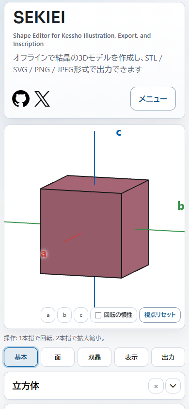

### ツール内マニュアルの使い方

このマニュアルは、ツール内からも確認できます。

- デスクトップでは、ヘッダーの `マニュアル` ボタンから開けます
- スマホでは、ヘッダー右上の `メニュー` から `マニュアル` を選びます
- デスクトップでは、左側の目次から項目へ移動できます
- スマホでは、マニュアル上部の `目次を開く` から項目を選べます
- マニュアルは画面上に表示され、作業中の入力内容はそのまま残ります

### お知らせの見方

起動時には、更新履歴と既知の問題をまとめた `お知らせ` が表示されることがあります。

- 一度閉じた内容は、同じ更新日のままでは自動再表示しません
- ヘッダーの `お知らせ` ボタンからいつでも開き直せます
- ヘッダー左上の GitHub / X アイコンから、レポジトリや作者の案内先を開けます
- スマホでは、`お知らせ` と言語切り替えはヘッダー右上の `メニュー` からも開けます

## 2. まずこれだけ

### 最短の使い方

最初は次の順番で使うのがおすすめです。

1. プリセットを選ぶ
2. 必要なら結晶パラメーターを調整する
3. 必要なら面一覧で面や結晶を編集する
4. 双晶を作る場合は、面一覧で結晶を追加してから双晶パラメーターを調整する
5. プレビューで形状と表示を確認する
6. 出力形式を選んで保存する

### 迷ったら触る場所

- 形状の出発点を選びたい
  - `プリセット`
- 軸比や軸間角を変えたい
  - `結晶パラメーター`
- 面の数や色を変えたい
  - `面一覧`
- 双晶を作りたい
  - `面一覧` で結晶を追加してから `双晶パラメーター`
- 見え方を変えたい
  - `表示モード` と `表示トグル`
- ファイルを保存したい
  - `保存` またはスマホの `出力` タブ

### 主なボタンとメニュー

このマニュアルでは、文字だけのボタンはスクリーンショットに頼らず、名前と役割を本文で説明します。

- `保存`
  - 現在の内容を、選んだ形式で保存します
- `名前を付けて保存`
  - 保存時のファイル名を指定して保存します
- `JSONを読み込む`
  - Sekiei の JSON を読み込みます。読み込み対象は `全て`、`結晶データ`、`プレビュー設定` から選べます
- `お知らせ`
  - 更新履歴と既知の問題を開きます
- `マニュアル`
  - このマニュアルをツール内で開きます
- `+`
  - 面一覧では結晶を追加します
- `面を追加`
  - 現在選んでいる結晶へ面を 1 つ追加します
- `面を全削除`
  - 現在選んでいる結晶の面一覧を空にします
- `等価な面を作成`
  - 選んだ面と同じ種類の向きをまとめて追加します
- `視点リセット`
  - プレビューの向きと表示範囲を見やすい状態へ戻します

### 保存形式の選び方

- STL
  - 3D モデルとして使う場合
- SVG
  - 線やラベルを含むベクター画像として使う場合
- PNG / JPEG
  - 画面で見たプレビューを画像として使う場合
- JSON
  - Sekiei で後から続きを編集したい場合

## 3. 基本チュートリアル

### 単結晶を作って STL 保存する

1. `プリセット` で出発点にしたい結晶を選びます
2. 必要なら `結晶パラメーター` の `モデルサイズ`、`軸比`、`軸間角` を調整します
3. `面一覧` で不要な面を非表示または削除します
4. プレビューで形状を確認します
5. `保存` から `STL` を選びます

プリセットは初期値の出発点です。選択後に手で調整しても問題ありません。

### プリセットから始める

画面上部のプリセット欄から、よく使う形状を選べます。

- プリセットを選ぶと、結晶系、軸比、軸間角、面一覧などが入力されます
- 単結晶プリセットを選ぶと結晶は 1 つになり、双晶プリセットを選ぶと双晶構成が入力されます
- プリセット選択後も、表示モードや表示トグルは現在の設定を維持します
- プリセット選択後に、各値をそのまま編集できます

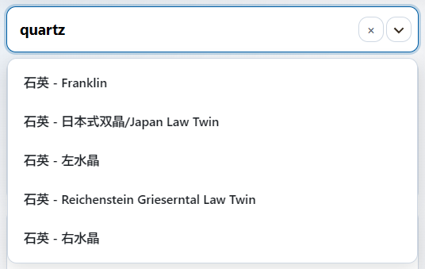

### 双晶を作る

1. 基準になる結晶を作ります
2. `面一覧` の結晶タブで `+` を押し、結晶を追加します
3. `双晶パラメーター` で追加した結晶の設定を調整します
4. `双晶タイプ` を選びます
5. 接触双晶では、双晶面と接触面参照を設定します
6. 貫入双晶では、双晶軸、回転角、必要なら軸方向オフセットを設定します
7. プレビューで位置関係を確認します
8. STL / SVG / PNG / JPEG を保存します

双晶パラメーターカードは、双晶の設定を調整する場所です。結晶を増やす入口は `面一覧` の結晶タブです。

### 面に文字を入れる

1. `面一覧` で対象面を探します
2. その面の `文字` 設定を開きます
3. 刻印文字、フォント、文字サイズ、深さを設定します
4. 横位置、縦位置、回転角で配置を調整します
5. プレビューで位置とサイズを確認します
6. 面上に重なる輪郭線で、実際の文字境界と面内の配置を確認します

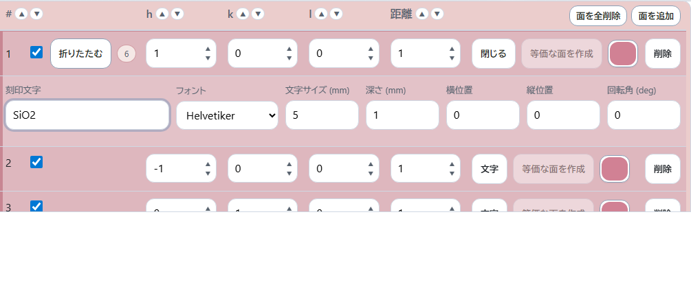

### 画像として保存する

1. プレビューの向き、表示モード、表示トグルを整えます
2. 必要なら `視点リセット` や軸方向ボタンで向きを揃えます
3. `保存` から `SVG`、`PNG`、`JPEG` のいずれかを選びます

SVG は線やラベルを含む画像として扱いやすく、PNG / JPEG はプレビューの見た目をそのまま使いたい場合に向いています。

## 4. 目的別ガイド

### 結晶パラメーターを調整する

`結晶パラメーター` では、結晶系、モデルサイズ、軸比、軸間角を調整します。

- `結晶系`
  - 入力欄や面指数の形式が切り替わります
- `モデルサイズ`
  - 生成されるモデル全体の最大寸法の目安です
- `軸比`
  - `a / b / c` の比率を入力します
- `軸間角`
  - `alpha / beta / gamma` を入力します

結晶系によって、一部の値は固定または連動します。

### 面一覧を編集する

面一覧は、結晶の外形を決める中心的な場所です。1 行が 1 つの面を表し、その面をどの向きに置くか、どれくらい中心へ近づけるか、何色で表示するかを調整します。

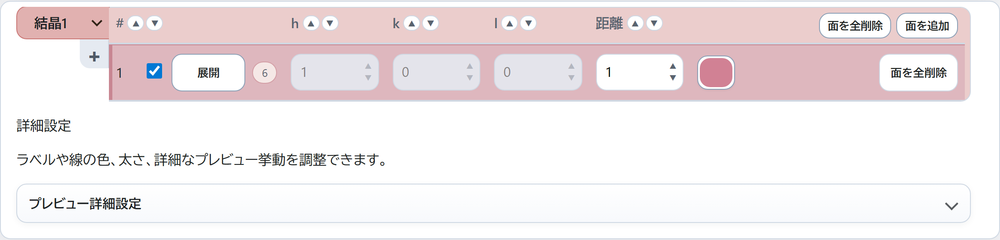

ミラー指数を知らなくても、まずは次の感覚で使えます。

- `h / k / l`
  - 面の向きを決める数字です
- `i`
  - 三方晶系・六方晶系で出る追加の数字です
- `距離`
  - その面を中心からどれくらい離れた位置に置くかを決める数字です
- `色`
  - その面の表示色です
- 表示切り替え
  - その面を形状に使うかどうかを切り替えます
- 文字設定
  - その面に刻印やラベル文字を入れます

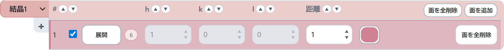

デスクトップでは表形式、スマホでは面ごとのカード形式で編集します。

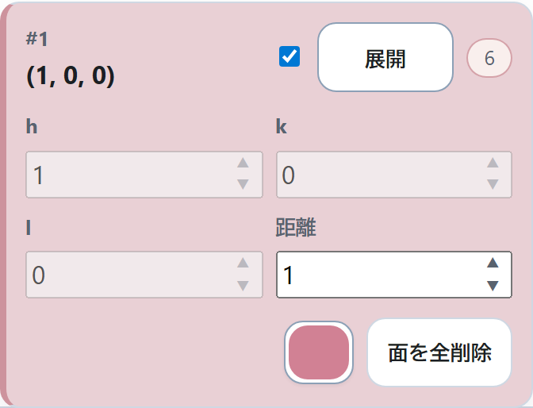

`面を追加` を押すと、現在選んでいる結晶に新しい面の行が追加されます。追加した行で `h / k / l`、距離、色を入力して、形状に使う面を増やします。

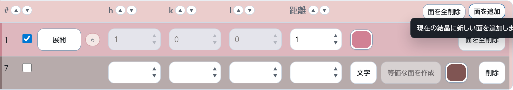

### 面指数 h / k / l の考え方

`h / k / l` は、面の向きを表す数字です。ここでは厳密な結晶学用語として覚える必要はありません。

- `h` を変える
  - a 軸方向に対する面の向きが変わります
  - 絶対値が大きくなると a 軸の中心に近い位置を面が通るように、小さくなると a 軸の中心から遠い位置を面が通るように変わります
  - `0` の場合、その面は a 軸とは交わりません
  - 正の場合は a 軸の正側、負の場合は a 軸の負側と面が交わります
- `k` を変える
  - b 軸方向に対する面の向きが変わります
  - 絶対値が大きくなると b 軸の中心に近い位置を面が通るように、小さくなると b 軸の中心から遠い位置を面が通るように変わります
  - `0` の場合、その面は b 軸とは交わりません
  - 正の場合は b 軸の正側、負の場合は b 軸の負側と面が交わります
- `l` を変える
  - c 軸方向に対する面の向きが変わります
  - 絶対値が大きくなると c 軸の中心に近い位置を面が通るように、小さくなると c 軸の中心から遠い位置を面が通るように変わります
  - `0` の場合、その面は c 軸とは交わりません
  - 正の場合は c 軸の正側、負の場合は c 軸の負側と面が交わります
- 符号を反転する
  - 反対側を向いた面になります
- すべてを `0` にする
  - 面の向きが決まらないため使えません

たとえば `(1, 0, 0)` と `(-1, 0, 0)` は、同じ軸に関係する反対側の面です。`(1, 1, 0)` のように複数の数字を入れると、複数の軸にまたがる斜めの面になります。

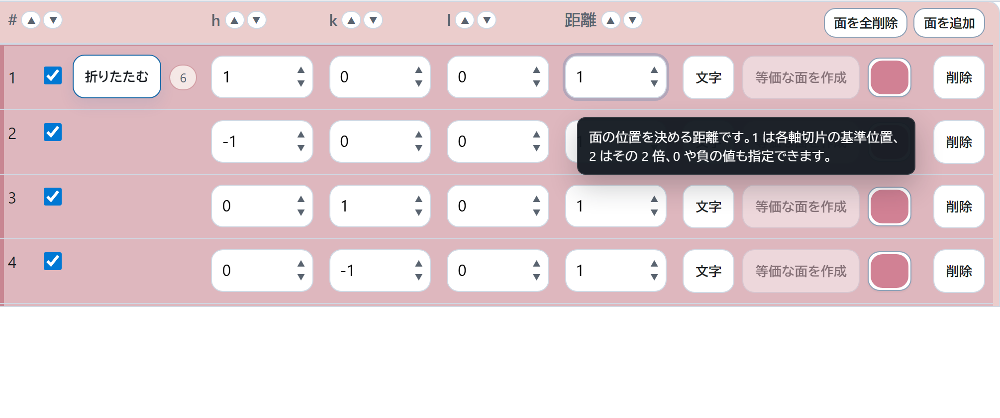

### i が出る結晶系

三方晶系・六方晶系では、`h / k / i / l` の 4 つで面を表します。

- `i` も `h / k / l` と同じように、面の向きに関わる数字です
- Sekiei では `i` は直接入力できず、`h` と `k` から自動で決まる読み取り専用の値です
- 自動計算では、`h + k + i = 0` になるようにします
- 例として `h = 1`、`k = 0` の場合、`i = -1` になります

通常操作では、`i` を自分でそろえる必要はありません。`h` や `k` を増減すると、それに合わせて `i` も自動で変わります。

### 距離の考え方

`距離` は、その面が結晶の中心からどれくらい離れているかを調整する数字です。形を作るときは、各面が結晶を外側から切り取る境界として働きます。

- 距離を大きくする
  - その面が外側へ離れ、その方向が長くなります。基本的には面が小さくなります
- 距離を小さくする
  - その面が中心へ近づき、その方向が短くなります。基本的には面が大きくなります
- 距離を `0` にする
  - その面は中心を通ります。ほかの面と組み合わせて閉じた立体になる場合だけ使えます
- 距離を負にする
  - 面は反対側へ回り込みます。反対側の面との関係によっては閉じた立体として使えます
- すべての面の距離を同じ倍率で変える
  - 最後に `モデルサイズ` へ合わせて拡大縮小されるため、見た目の比率はほぼ変わりません

軸比 `a / b / c` の結晶で `(1, 1, 1)` 面の距離を `1` にすると、その面は a 軸上の距離 `a`、b 軸上の距離 `b`、c 軸上の距離 `c` の点を通ります。距離 `2` なら、それぞれ `2a / 2b / 2c` の点を通ります。

形を調整したい時は、1 つの面だけを少し大きくまたは小さくして、プレビューで変化を見るのが分かりやすいです。

### 面の表示切り替え

面ごとの表示切り替えは、その面を現在の形状に使うかどうかを切り替えます。

- オン
  - その面を使って立体を作ります
- オフ
  - その面を一時的に外します

面を削除する前に、まず表示をオフにして形がどう変わるか確認すると戻しやすいです。

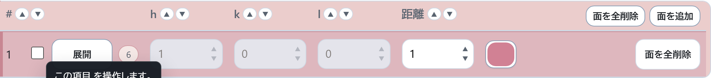

### 等価な面を作成

`等価な面を作成` は、選んだ面と同じ種類の向きをまとめて追加する操作です。対称性のある結晶で、同じ役割の面を一括でそろえたい時に使います。

たとえば 1 つの側面だけを作ったあと、対応する側面をまとめて増やしたい場合に便利です。追加後も、不要な面は表示をオフにしたり削除したりできます。

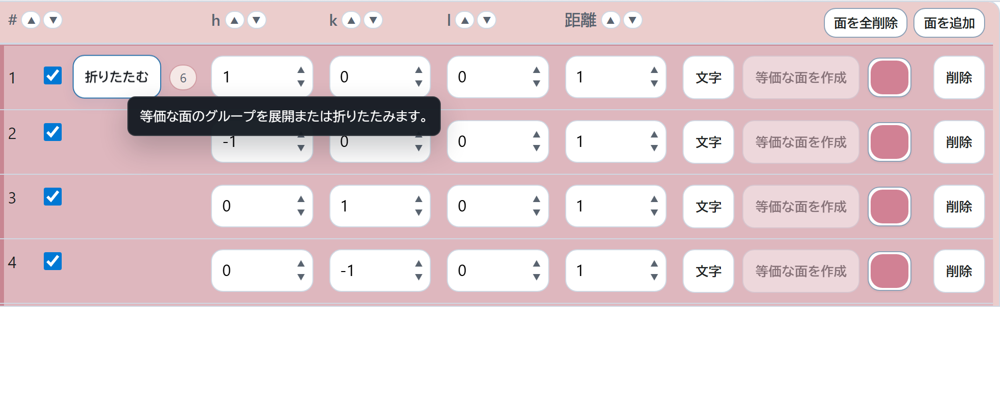

### 面の色と文字

面一覧では、面ごとの色と文字も設定できます。

- 色
  - プレビューや画像出力で見える面の色を変えます
- 文字
  - 面に刻印やラベルとして表示する文字を設定します

文字を入れた面では、プレビュー上に文字の輪郭線が表示されます。輪郭線を見ながら、文字が面の内側に収まっているか確認できます。

### 結晶を増やす

双晶を作る場合や複数結晶を重ねたい場合は、面一覧の結晶タブを使います。

- 左側のタブで対象結晶を切り替えます
- `+` で結晶を追加します
- タブ右側のメニューから結晶の複製、色変更、削除ができます

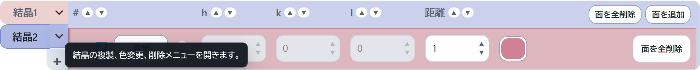

結晶を追加したあと、`双晶パラメーター` で配置方法を調整します。

### 双晶パラメーターを調整する

双晶パラメーターでは、追加した結晶をどのように配置するかを設定します。

- 生成元結晶
- 双晶タイプ
- 双晶面または双晶軸
- 回転角
- 軸方向オフセット
- 接触面参照
- 基準方向

接触双晶では、接触面どうしを合わせます。貫入双晶では、双晶軸まわりに回転した結晶を重ねて配置します。

貫入双晶の `軸方向オフセット` は、追加した結晶を双晶軸方向へずらす値です。`0` では軸方向へずらしません。正の値は双晶軸の正方向、負の値は反対方向へ動きます。

`1` は、双晶軸と同じ指数で距離 `1` の面が、その双晶軸と交わる位置までの軸上距離を基準にします。実際の移動量は線形なので、`0.5` は半分、`2` は 2 倍の距離になります。

### プレビューを整える

プレビューでは、形状だけでなく見せ方も確認できます。

- 表示モードを切り替える
- 面指数、稜線、交線、軸線、ラベルを表示または非表示にする
- 結晶ごとの表示を切り替える
- 必要なら `プレビュー詳細設定` で線色やラベルを調整する

面文字が入っている面では、文字と面の境界が補助線として表示されます。これは `交線` トグルとは独立して表示され、面文字の位置や大きさの確認に使えます。

### スマホで操作する

スマホでは、プレビュー下部のタブから編集カテゴリを切り替えます。

- `基本`
  - 形状の出発点や結晶パラメーターを調整します
- `面`
  - 面一覧と面文字を編集します
- `双晶`
  - 双晶パラメーターを調整します
- `表示`
  - プレビューの見え方を調整します
- `出力`
  - 保存と JSON 読み込みを行います

プレビュー操作は次の前提です。

- 1本指で回転
- 2本指で拡大縮小
- `視点リセット` で表示を整える

### JSON で保存・再開する

後から Sekiei で編集を続けたい場合は、JSON を保存します。

- `JSON保存`
  - 結晶データとプレビュー設定を保存します
- `JSON読込（全て）`
  - 結晶データとプレビュー設定を読み込みます
- `JSON読込（結晶データ）`
  - 形状や面一覧だけを読み込みます
- `JSON読込（プレビュー設定）`
  - 表示設定だけを読み込みます

## 5. 各機能の説明

### STL分割（β版）

結晶パラメーターカードの下部には、STL 保存時だけに使う `STL分割を有効にする（β版）` があります。

- `STL分割を有効にする（β版）` をオンにすると、通常の STL 保存時に分割処理を行います
- 分割平面の指数入力欄は、この設定をオンにした時だけ表示されます
- 分割平面は、結晶1の中心を通る指定面指数の平面です
- 指定した面で分割した STL を保存できます
- STL分割の設定は、JSON 保存には含まれません

### 表示モード

右側カードの上部で表示モードを選べます。

- 等価面
  - 等価な面を同じ系統の色で見ます
- 単色
  - 結晶ごとの単色表示で形を確認します
- グレー
  - 色の影響を減らして形状を確認します
- 半透明
  - 内部や背面側の関係を確認します
- カスタム(β版)
  - 詳細設定で指定した見え方を使います

### 表示トグル

右側カードでは、次の表示を切り替えられます。

- 面指数
- 稜線
- 交線
- 軸（内）
- 軸（外）
- 軸ラベル
- 双晶軸 / 双晶面ガイド
- 分割面
- ラベル
- 結晶ごとの表示

### プレビュー詳細設定

`プレビュー詳細設定` では、表示の細かい設定を調整できます。

- 線色
- 線幅
- 透明度
- ラベル色
- フォント
- カスタム表示設定

### 保存と読み込み

ヘッダーの保存メニューから次を選べます。

- STL
- SVG
- PNG
- JPEG
- JSON

スマホでは、主な保存と読み込みは `出力` タブにまとまっています。

- `プロジェクトデータ`
  - `JSON保存`
  - `JSON読込（全て / 結晶データ / プレビュー設定）`
- `3Dモデル`
  - `STL`
- `プレビュー画像`
  - `SVG / PNG / JPEG`

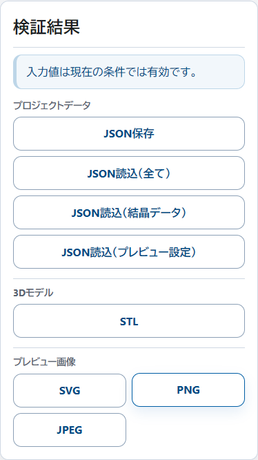

## 6. 困ったとき

### プリセットが見つからない

- 日本語名、英語名、鉱物名の一部で検索してください
- 目的のプリセットがない場合は、近い形状を選んで手で調整してください
- `カスタム入力` に戻すと、現在の手入力内容を保ったまま編集できます

### プレビューが見づらい

- `視点リセット` を押してください
- 表示モードを `単色` や `グレー` に変えてください
- 面指数や軸ラベルが多い場合は、表示トグルで一部を非表示にしてください
- 半透明表示では、背面側の線や面も見えるため、必要に応じて通常表示へ戻してください

### 双晶が意図した位置にならない

- 面一覧で結晶が追加されているか確認してください
- `生成元結晶` が意図した結晶を指しているか確認してください
- 接触双晶では、基準側と派生側の接触面参照を確認してください
- 貫入双晶では、双晶軸、回転角、軸方向オフセットを確認してください
- 表示トグルで `双晶軸 / 双晶面ガイド` を表示すると確認しやすくなります

### 面に入れた文字が見えない

- 対象面の `文字` 設定が開かれているか確認してください
- 文字サイズと深さが小さすぎないか確認してください
- 面の表示がオフになっていないか確認してください
- プレビュー上の文字輪郭線で、文字が面の内側に入っているか確認してください

### STL や画像の保存で迷う

- 3D データとして使うなら STL を選んでください
- 図版として編集したいなら SVG を選んでください
- 見た目をそのまま共有したいなら PNG または JPEG を選んでください
- 後から Sekiei で再編集するなら JSON を保存してください

### JSON 読み込みで迷う

- 以前の作業状態をそのまま戻すなら `全て` を選んでください
- 今の表示設定を残して形状だけ入れ替えたいなら `結晶データ` を選んでください
- 形状を残して見え方だけ戻したいなら `プレビュー設定` を選んでください

### スマホで項目が見つからない

- 形状の基本設定は `基本` タブを見てください
- 面の編集は `面` タブを見てください
- 双晶の設定は `双晶` タブを見てください
- 見え方の調整は `表示` タブを見てください
- 保存と読み込みは `出力` タブを見てください

## 7. 補足

- 複雑な双晶構成では、警告が出ることがあります
- プリセットは初期値の出発点として使い、その後に手で調整できます
- 日本語 UI を基準にしていますが、英語 UI へ切り替えることもできます
- マニュアルの内容やスクリーンショットは、UI の変更に合わせて更新します
